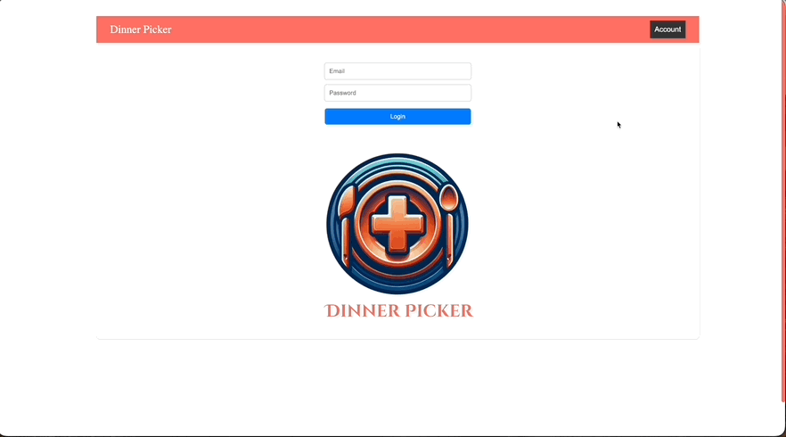
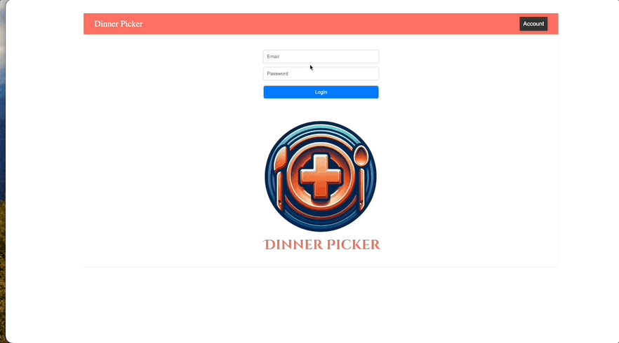
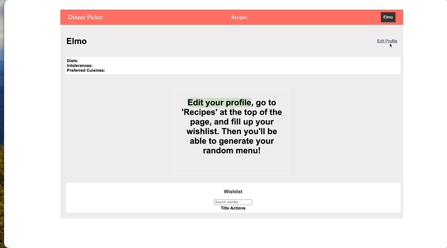
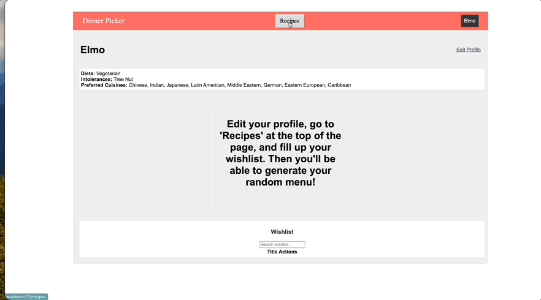
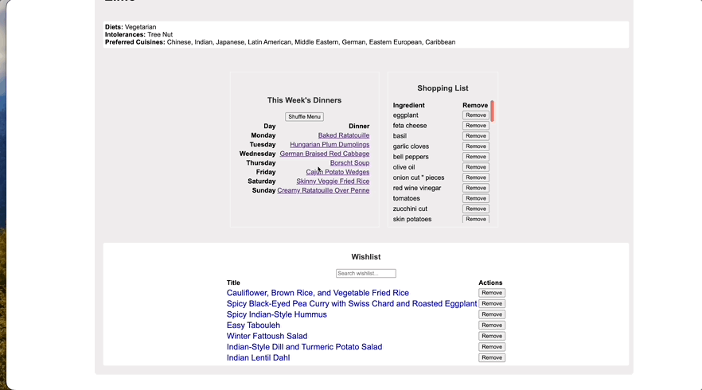
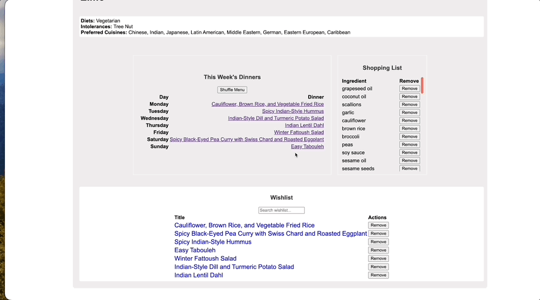

# Dinner Picker

Dinner Picker is an application designed to make meal planning easier and more enjoyable. With a vast database of recipes, dietary options, and user preferences, Dinner Picker helps you discover new dishes, create randomized menus, and generate shopping lists effortlessly.

## Features

- **Recipe Exploration:** Browse through a diverse collection of recipes ranging from various cuisines, dietary restrictions, and meal types.
- **Personalized Profiles:** Customize your dietary preferences, intolerances, and favorite cuisines to tailor recipe suggestions to your taste.
- **Menu Randomization:** Generate randomized menus based on your preferences to add variety to your meals.
- **Shopping List Generation:** Automatically generate a shopping list based on the ingredients required for your selected recipes.
- **User Authentication:** Securely log in to your account to access personalized features and save your preferences.

## Installation

To use Dinner Picker, follow these steps:

1. Clone the repository to your local machine:

    git clone git@github.com:zachlandis/Dinner-Picker.git

2. Navigate to the project directory:

    cd dinner-picker

3. Install dependencies using npm or yarn:

    npm install
    OR
    yarn install

4. Set up the backend server:

    rails db:create
    rails db:migrate
    rails s

5. Start the frontend development server:

    npm run dev

6. Access the application in your web browser at `http://localhost:3000`.

## Usage

### Registration

1. Navigate to the sign up page by clicking on the 'Account' dropdown and selecting 'Sign Up'.

2. Enter your details (email, username, password) and click the Sign Up button.

    

### Logging In

1. Navigate to the login page by clicking on the "Login" button in the 'Account' dropdown.

2. Enter your credentials (username and password) and click the "Login" button.

    

### Editing Profile

1. Once logged in, click on the "Edit Profile" button in the navigation bar.

2. Update your dietary restrictions, intolerances, and preferred cuisines as desired.

3. Click the "Save" button to apply the changes.

    

### Browsing Recipes

1. Explore recipes by clicking on the "Recipes" link in the navigation bar.

2. Use the filters on your profile to narrow down the recipe options based on cuisine, dietary restrictions, etc.

3. Click on a recipe card to view detailed instructions and ingredients.

4. On the Recipe Page, click 'Add to Wishlist' to add the recipe to your profile's wishlist.
    
    

### Generating Menus

1. Click on the "Generate Menu" button to create a randomized menu with items in your wishlist.

    

### Managing Shopping Lists

1. After generating a menu, view the "Shopping List" section to see the ingredients required for the selected recipes.

2. If you already have the ingredient in  your pantry, use the "Remove" button next to each ingredient to remove items from the list as needed.

    

## Contributing

We welcome contributions from the community! If you have ideas for new features, improvements, or bug fixes, please submit a pull request.

## License

This project is not licensed.

## Support

For any questions, issues, or feedback, please contact us at info@landotechsolutions.com. We're here to help!

